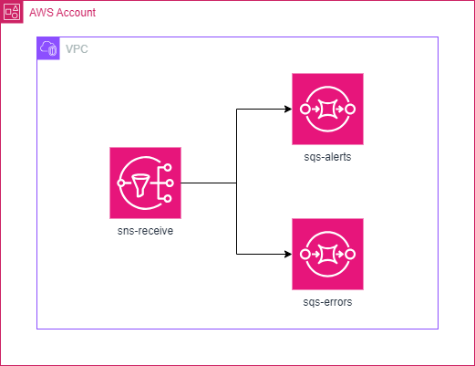

# POC infra as code - Arquitetura Fanout

## Descrição

POC simples de uma arquitetura fanout, utilizando:
- Terraform
- policy 
- kms
- sns
- sqs
- localstack

---

## Pré Requisitos

- Ter o docker instalado e configurado
- Ter terraform instalado

---


## Como foi construído?

Utilizando a arquitetura fanout:



---

## Como executar?

#### Preparando o ambiente

- Inicie seu docker:
```shell
"C:\PROGRA~1\Docker\Docker\Docker Desktop.exe"
``` 
- Execute o comando:
```shell
docker-compose up
``` 
- Se tudo ocorreu bem seu ambiente está configurado.

#### Executando criação da infraestrutura

- Devemos ir até a pasta de infraestrutura e executar o comando:
```shell
cd ./infra && terraform init && terraform plan && terraform apply -auto-approve
```

---

## Como enviar mensagens ao tópico sns?

#### Configurar o arquivo de credenciais da aws

- Dentro da pasta `~/.aws/` crie um arquivo chamado `credentials` e adicione o seguinte conteúdo:
- Substitua os valores de `aws_access_key_id` e `aws_secret_access_key` pelos valores que estão no arquivo `docker-compose.yml`:

```text
[localstack]
aws_access_key_id=teste
aws_secret=teste
```

#### Configurar o arquivo de config da aws

- Dentro da pasta `~/.aws/` crie um arquivo chamado `config` e adicione o seguinte conteúdo:
- Substitua o valor de `region` pelo valor que está no arquivo `docker-compose.yml`:

```text
[profile localstack]
region=sa-east-1
output=json
endpoint_url=http://localhost:4566
[default]
region = sa-east-1
output = json
```

#### Mensagem para fila de alerta

```shell
aws sns publish \
 --topic-arn "arn:aws:sns:sa-east-1:000000000000:sns-receive-env-dev" \
 --message="Mensagem de teste" \
 --message-attributes '{"tipo":{"DataType":"String","StringValue":"alerta"}}' \
 --endpoint-url=http://localhost:4566 \
 --profile=localstack
```

#### Mensagem para fila de erro

```shell
aws sns publish \
 --topic-arn "arn:aws:sns:sa-east-1:000000000000:sns-receive-env-dev" \
 --message="Mensagem de teste" \
 --message-attributes '{"tipo":{"DataType":"String","StringValue":"erro"}}' \
 --endpoint-url=http://localhost:4566 \
 --profile=localstack
```

## Projeto consumidor da fila SQS

- Foi criado um projeto que consome da fila sqs e envia a mensagem para outra fila.
- Os parâmetros de adaptador de saída são fakes e não enviam a mensagem para lugar algum, apenas imprime no console o ato realizado.

#### Executando o projeto

- Devemos executar o comando: 
```shell
cd ms-consumer-sqs && ./gradlew :configuration:bootRun --args='--spring.profiles.active=local'
```
